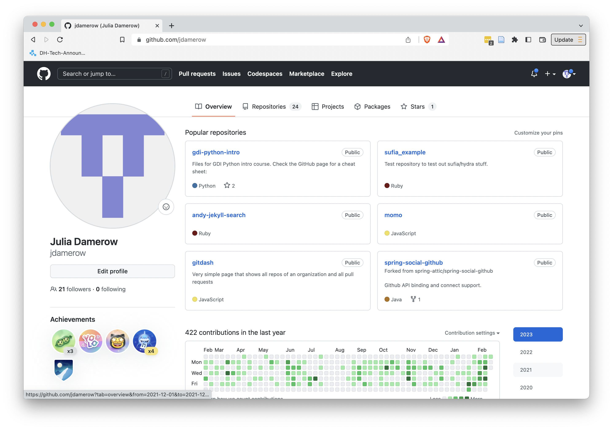

# GitHub

Let's look at the architecture of a distributed version control system again.


An important part are remote repositories. Remote repositories are copies of the version history of a project that live on a different computer. Remote repositories make sure you have a backup of your project, but also enable you to collaborate on a project. Here, we'll be using GitHub as a cloud service to keep our remote repositories. You can create an account for free [here](https://github.com/signup). With a free account you can create public and private repositories (although priviate repositories have some restrictions to them, such as the number of collaborators allowed).

## Creating Remote Repositories

We will start by creating a new repository on GitHub. Go to your GitHub page. It'll be the form of `https://github.com/your-username`. It will look something like the following (although if you just created your account, it will look more empty).



Click on the "Repositories" tab. Then press the green "New" button. Enter a name for your new repository (keep in mind that you cannot have blanks in the name). Leave all the default settings the way they are (except potentially the "Description" field, you can enter a short description here, e.g. "Repository for Git exercise.") and click "Create repository."

After you created the repository, GitHub will show you how to add files to the new repository. Since we already have a local repository, we will use the the second set of instructions:

```
git remote add origin https://github.com/your-username/your-repo-name.git
git branch -M main
git push -u origin main
```

## Pushing Code

To push your code to the new remote repository, go back to your project in the terminal. Then follow the instructions from GitHub (make sure you are in your project folder, the folder that has the `.git` directory).

```
git remote add origin https://github.com/your-username/your-repo-name.git
git branch -M main
git push -u origin main
```

Once these command execute succesfully, you can go back to GitHub and will now see that all your files are in the remote repository. Note that only files that were committed before will have been pushed.