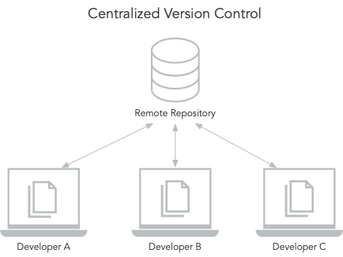
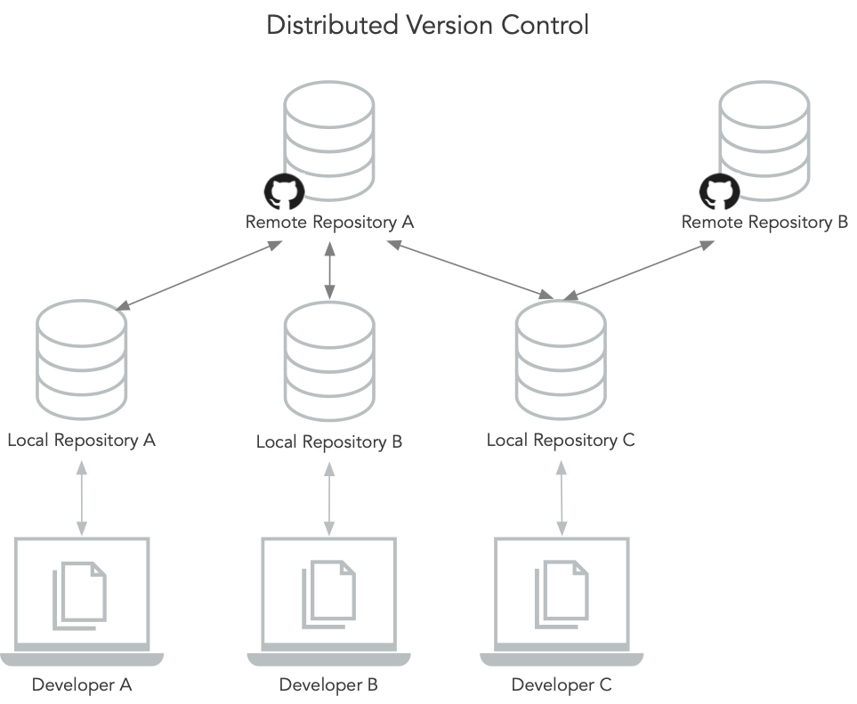

# Version Control with Git

> Version control, also known as source control, is the practice of tracking and managing changes to software code. Version control systems are software tools that help software teams manage changes to source code over time. [...]
> 
> Version control software keeps track of every modification to the code in a special kind of database. If a mistake is made, developers can turn back the clock and compare earlier versions of the code to help fix the mistake while minimizing disruption to all team members.

<small>Source: "What is Version Control?", https://www.atlassian.com/git/tutorials/what-is-version-control</small>

You can use version control not just for code but for any textual document. You can version your CSV files, Latex files, or other text files.

Git is one of the most popular version control software. GitHub is a cloud service that allows you to store your version histories in the cloud, making it possible to easily share your code and other documents and collaborate with others.

## Centralized vs. Distributed Version Control

There are two types of version control systems: centralized and distributed version control systems. In a centralized version control system, there is a server that keeps the history of all the versions of your code. The clients simply keep the latest version and submit their changes to the server.

In a distributed version control system (like Git), every developer who works with the code has a full copy of the complete version history (of the repository). And there can be several different repositories, developers submit to and pull from. A distribributed version control system has the benefit that there are multiple backups of the code by design. Basically, every developer who works on the code has a backup and should all the servers that host the remote copy of the code go up in flames, there is still a decent change that there exists another copy of the code on a developer's machine.

